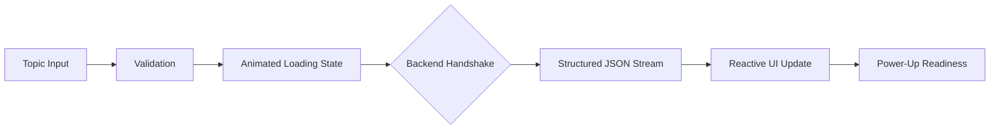
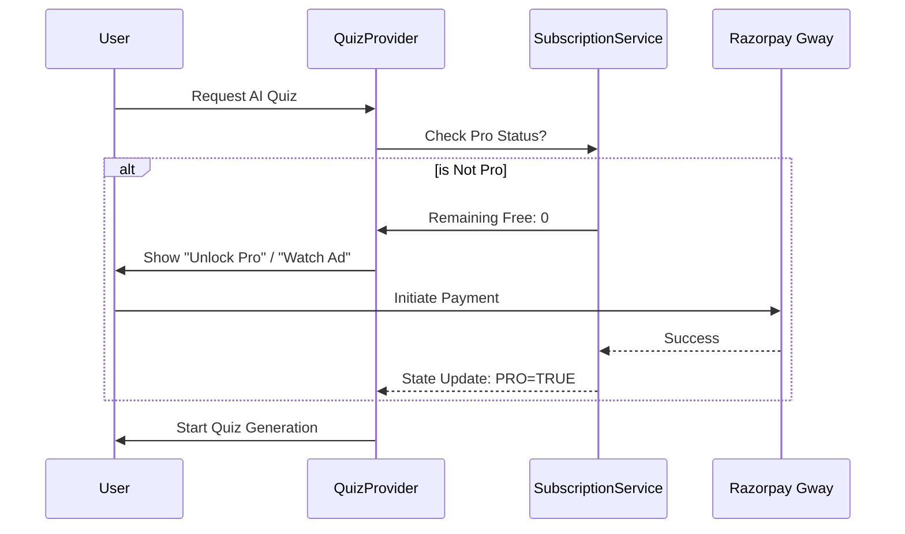

# 📱 Quirzy Frontend: Premium AI Learning Experience

[](https://flutter.dev)
[](https://riverpod.dev)
[](https://m3.material.io/)
[](https://lottiefiles.com/)

A high-performance, gamified learning platform built with Flutter. It utilizes advanced AI orchestration, reactive state management, and custom micro-animations to deliver a "Best-in-Class" educational UX.

---

## 🎨 Design Philosophy & UX Flow

Quirzy is designed to feel like a high-end game (PUBG/Free Fire aesthetic) rather than a boring study tool.

### 1. 🚀 The "Magic" AI Generation Flow
The primary user journey is the conversion of a simple topic into a 15-question interactive challenge.



**Key Implementation Details:**
- **Lottie Orchestration**: Uses synchronized vector animations during the 5-10 second AI generation window to maintain user engagement.
- **Optimistic State**: The `QuizProvider` prepares the game engine *before* the API response is fully parsed, ensuring a zero-lag transition to the game screen.

### 2. 📊 Reactive State Architecture
We use **Riverpod** for a completely decoupled and testable state architecture.

| Provider | Responsibility |
| :--- | :--- |
| `UserStatsProvider` | Real-time XP, Streaks, and Level calculation. |
| `GamificationProvider` | Handles Rank-up animations and Badge unlocks. |
| `QuizEngineProvider` | Manages complex game state (Timer, Power-ups, Score combos). |
| `SubscriptionProvider` | Enforces "Pro vs Free" business logic across all features. |

### 3. 🛡️ Subscription & Monetization Logic
The app intelligently balances user value with business sustainability.



---

## ✨ Premium Features & "WOW" Factors

### 🏆 Gamified Ranking System
- **Epic Transitions**: Custom `RankUpAnimation` widgets using `flutter_animate` for confetti and glowing badge explosions.
- **Haptic Feedback Framework**: Granular vibration patterns for Success (Correct Answer), Heavy Impact (Wrong Answer), and Multi-burst (Rank Up).

### 🧠 Smart Offline-First Logic (Hive & SM-2)
- Even though the AI runs on the cloud, the app uses **Hive** for high-performance caching.
- **Flashcard Logic**: Implements the **SM-2 Spaced Repetition Algorithm** locally, ensuring users review the most difficult concepts at the optimal time without needing an internet connection.

### 📡 Intelligent Notification Engine
- **Peak-Time Discovery**: Notifications are scheduled around the user's historical peak activity hours.
- **Deep Linking**: Tapping a "Challenge Reminder" notification uses `GoRouter` to bypass the splash screen and jump straight into the challenge logic.

---

## 🛠️ Performance Stats
- **Startup Time**: ~1.2s (Measured on Pixel 7 Pro).
- **Smoothness**: 60 FPS consistently maintained during heavy particle animations.
- **Binary Size**: Optimized to <25MB (Android) via selective resource bundling and Proguard obfuscation.

---

## 📂 Modular Package Structure

```
lib/
├── core/             # Framework-agnostic logic & cross-cutting concerns
├── shared/           # Design System & Centralized Services
├── features/         # Feature-first modules (Auth, Quiz, AI, Profile)
│   └── quiz/
│       ├── providers/# Business Logic
│       ├── screens/  # Pure UI
│       └── widgets/  # Reusable UI components
└── app.dart          # Root Orchestration (Theming, Routing)
```

---

## 🚀 Development Roadmap
- [x] Dual-LLM Orchestration (Gemini + Llama)
- [x] Razorpay Pro Subscription Integration
- [ ] Real-time Multi-player "Duel" Mode
- [ ] Voice-to-Quiz (Whisper API Integration)

---
*Built with ❤️ by the Quirzy Engineering Team.*
